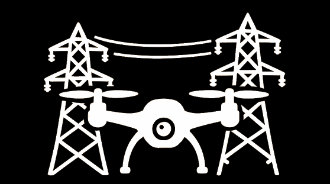

# PowerLineDrone



**Power Infrastructure Capture and Control Integrated Navigation Guidance System**

PowerLineDrone is an Android application that revolutionizes power transmission line inspection by providing autonomous drone flight control and automated image acquisition for infrastructure analysis.

## Project Overview

Power transmission infrastructure maintenance traditionally depends on manual inspections that involve high operational costs, safety risks, and low efficiency. PowerLineDrone addresses these challenges by enabling fully autonomous drone missions for power line inspection with precise positioning and standardized image capture.

Developed in partnership with EDP and Labelec Laboratory, this solution enables power utility companies to:
- Reduce inspection costs
- Improve worker safety
- Collect standardized, high-quality visual data
- Identify infrastructure issues early
- Optimize inspection routes

## Key Features

### Mission Planning & Execution
- **Structure Import**: Load structure coordinates from CSV files
- **Photo Position Import**: Define standardized photo positions relative to structures
- **Autonomous Flight**: Complete mission execution without manual coordinate entry
- **Waypoint Navigation**: Precise positioning for each inspection point
- **Photo Review**: On-the-fly review of captured images with accept/reject options

### User Interface
- **Adaptive Layouts**: Optimized for both portrait and landscape orientations
- **Real-time Status**: Live mission progress and drone telemetry
- **Mission Controls**: Start, pause, resume, and stop capabilities
- **Photo Gallery**: Browse, view, share, and manage captured images

### Media Management
- **Photo Capture**: Automated image acquisition at inspection points
- **Manual Mode**: Option for manual photo capture when needed
- **Image Storage**: Local storage with organized file structure
- **Photo Review**: Popup confirmation dialogs for immediate quality control

### Telemetry
- **Drone Status**: Real-time connection, model, and battery information
- **Position Data**: Current drone location coordinates and altitude
- **Mission Progress**: Structure and photo completion tracking

## Technology

PowerLineDrone is built using:
- **Java** for Android application development
- **DJI Mobile SDK** for drone communication and control
- **Android UI Toolkit** for the user interface
- **CSV Parsing** for mission data import

## Installation

### Prerequisites
- Android device running Android 6.0 (Marshmallow) or higher
- DJI drone compatible with Mobile SDK (Mavic, Phantom, or Matrice series)
- DJI Go 4 app installed (for initial drone setup)

### Setup
1. Clone the repository:
   ```
   git clone https://github.com/antoniolox1721/PowerLineDrone.git
   ```

2. Open the project in Android Studio

3. Build and install the application to your Android device:
   ```
   ./gradlew assembleDebug
   ```
   
4. Alternatively, download the latest release APK from the [Releases page](https://github.com/antoniolox1721/PowerLineDrone/releases)

## Usage

### Initial Setup
1. Connect your Android device to the DJI drone remote controller
2. Launch the PowerLineDrone application
3. Wait for the drone connection status to change to "Connected"

### Mission Planning
1. Tap "Import Structures" to load your structure coordinates CSV
   - CSV format: latitude,longitude,ground_altitude,structure_height
2. Tap "Import Positions" to load your photo positions CSV
   - CSV format: offset_x,offset_y,offset_z,gimbal_pitch

### Mission Execution
1. Tap "Start Mission" to begin the automated inspection
2. The drone will navigate to each structure and capture photos
3. When photo review is required, confirm or reject the photo
4. Use Pause/Resume to control mission flow as needed
5. To end the mission early, tap "Stop" to return to home position

### Photo Gallery
1. Tap "Gallery" to view all captured images
2. Select any photo to view in full screen
3. Use the Share or Delete options to manage your photos

## CSV File Formats

### Structures CSV
```
latitude,longitude,ground_altitude,structure_height
38.736946,-9.142685,10.5,25.0
38.737012,-9.143998,11.2,28.5
...
```

### Photo Positions CSV
```
offset_x,offset_y,offset_z,gimbal_pitch
5.0,0.0,3.0,-30.0
-5.0,0.0,3.0,-30.0
0.0,0.0,5.0,-90.0
...
```

## Project Team

This project is developed by a team from Instituto Superior Técnico in partnership with EDP:

- **Ricardo Nobre**: Testing and Documentation
- **João Henriques**: Camera and Multimedia Management
- **Miguel Baia**: Basic Flight Control
- **Henrique Martins**: Basic User Interface
- **Luís Almeida**: Waypoints and Missions
- **António Alves**: Advanced UI Development

## Scientific Advisors
- **André Coelho** (EDP)
- **Rui Martins** (EDP)

## Project Coordinators
- **Luis Caldas de Oliveira** (Coordinator)
- **Rita Cunha** (Mentor)

## Contributing

We welcome contributions to the PowerLineDrone project. Please feel free to submit pull requests or open issues to discuss potential improvements.

1. Fork the repository
2. Create your feature branch (`git checkout -b feature/amazing-feature`)
3. Commit your changes (`git commit -m 'Add some amazing feature'`)
4. Push to the branch (`git push origin feature/amazing-feature`)
5. Open a Pull Request

## License

This project is licensed under the MIT License - see the [LICENSE](LICENSE) file for details.

## Acknowledgments

- EDP for providing project sponsorship and expertise
- Labelec Laboratory for technical support
- DJI for the Mobile SDK that makes drone control possible

---

*PowerLineDrone - Making power infrastructure inspection safer, faster, and more efficient.*